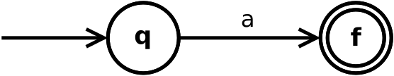
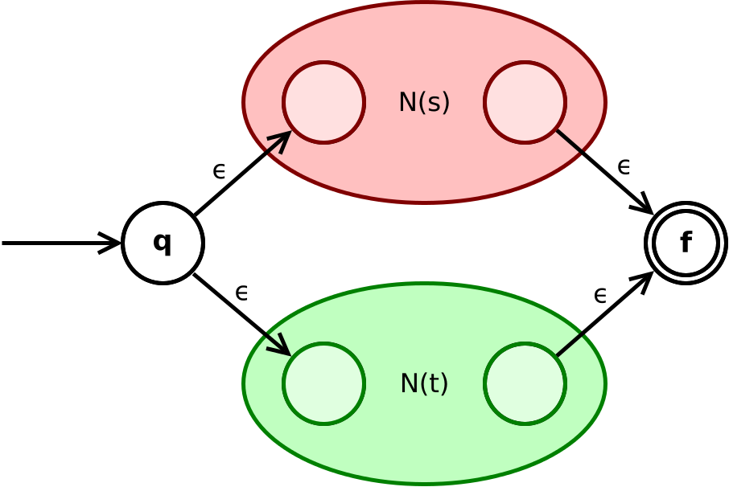
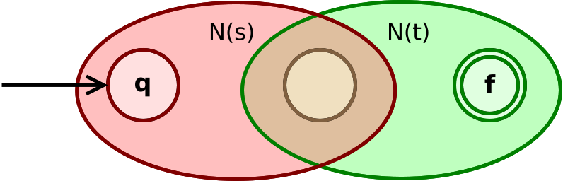

# Conformance Cheking Using NFA 

The goal of this project is to implement conformance checking in python with no dependencies. For this purpose, we have converted the regular expressions into NFAs, checked their fitness and have computed the optimal  alignments. This has been achieved keeping in view the optimality conditions for memory usage and runtime. The edge cases are catered by exhaustive testing including both manual and unit testing.

## Usage
Users can use the required module as per their project requirement by importing the library using the following code snippet:

`from library.nfa import Nfa, Place, Transition, nfa_from_regex`  
`from library import conformance, nfa`  

## Example

### Example 1: Creation of NFA from Regular Expression

One can create an Nfa easily from a regular expression as shown in the example below:

`from library.nfa import Nfa, Place, Transition, nfa_from_regex`  
`myRegexNfa = nfa_from_regex(["a", "*", "|", "(", "c", ".", "d", ")", "|", "(", "e", ".", "f", ")"])`  

The nfa is intended to accept arbitrary many a, or c followed by d, or e followed by f. By computing alignments for some traces we can see that this work correctly:

([('a', 'a'), ('a', 'a')], 0)  
([('a', 'a'), ('a', 'a'), ('a', 'a'), ('a', 'a')], 0)  
([('c', 'c'), ('d', 'd')], 0)  
([('e', 'e'), ('f', 'f')], 0)  
([('a', 'a'), ('c', '>>')], 1)  
([('c', 'c'), ('d', 'd'), ('c', '>>'), ('d', '>>')], 2)  
([('c', '>>'), ('f', '>>')], 2)  

**A more complex regular expression**: 

([('a', 'a'), ('x', '>>'), ('b', 'b'), ('b', 'b'), ('y', '>>'), ('c', 'c'), ('d', 'd'), ('c', 'c'), ('d', 'd'), ('c', '>>')], 3) 

### Example 2: These operations work also on logs instead of traces:

`from library.nfa import Nfa, Place, Transition, nfa_from_regex`  
`1example_log = [["a"], ["a", "b"], ["a", "b", "b"], ["a", "c", "d"], ["x"], ["x", "y"], ["y"], ["w"], ["k"], ["q"]]`  
The percentage of fiting traces of an example log L is:  0.4 

 
An alignment for a different log can look like the following:  

`from library.nfa import Nfa, Place, Transition, nfa_from_regex`  
`example_log_2 = [["a"], ["a", "c", "d"], ["b"], ["a", "c"]]`

[([('a', 'a')], 0), ([('a', 'a'), ('c', 'c'), ('d', 'd')], 0), ([('>>', 'a'), ('b', 'b')], 1), ([('a', 'a'), ('c', '>>')], 1)]

## Implementation Concepts

### Nfa data model

[Nfa are non-deterministic finite automaton](https://dl.acm.org/doi/10.1147/rd.32.0114) that were first introduced by  Michael O. Rabin and Dana Scott in 1959.
Formally they are described by a tuple of 5 parts (Q, Σ, ∆, q0, F).  
With Q being the finite set of states. 
Σ being the finite set of input symbols. 
∆ : QΣ → P(Q) being the transition function where it is possible to have non determinis-tic behaviour such that an input can have multiple places as the target from a given startplace. 
q0 being the initial start place.  F is a set of places that are allowed final states.

First, we created a data model that mimicked this tuple of five elements.
Obviously there are multiple duplications and inefficiencies when storing the nfa like that, so we came up with multiple iterations of improvements.
As defined in the requirements we had mainly two metrics we wanted to optimize: Memory usage and run time.

The main way we reduced the memory usage was by removing duplicated information.
As a result the nfa data model does not store the set of events separately but instead it is indirectly given as the union of the events that occur in all the transitions.

The main way we increased the performance of for example the function that checks whether a trace can be replayed by the given nfa model is that we do not store all possible transitions together at the nfa level, but instead each place in the nfa stores all the transitions that are connected to it.
As each transition has only one start node this creates no duplication and is therefore equally memory efficient.
This way of storing the transitions improves the performance because when replaying a trace on a model one is only interested in possible transitions connected to the current place and not in transitions not connected to the current place.

This also creates the possibility to reduce the memory usage of an nfa further by not having to store the start place with the transition as this is always defined to be the place that has a reference to the transition.

In addition we have added the possibility to use epsilon transition in the nfa model which is then called an ε - nfa.
For simplicity reasons we are going to write nfa instead of ε - nfa as there exist a conversion between them any ways and it just shorter to read and write.

### Transformation from a regular expression into a nfa

The proof that regular expressions and nfas (ε - nfas) can represent the same languages is constructive one that is known as the [Thompson's construction](http://ce.sharif.edu/courses/94-95/1/ce414-2/resources/root/Text%20Books/Compiler%20Design/Alfred%20V.%20Aho,%20Monica%20S.%20Lam,%20Ravi%20Sethi,%20Jeffrey%20D.%20Ullman-Compilers%20-%20Principles,%20Techniques,%20and%20Tools-Pearson_Addison%20Wesley%20(2006).pdf).
This describes rules to convert any regular expression into an ε - nfa.

But before the algorithm can apply the construction rules, the regex need to be parsed so that the program understands the regular expression in a correct manner. 
To do so, we evaluated to different approaches.
One being a [conversion from the infix notation of a regular expression into the prefix notation](https://www.researchgate.net/publication/292137900_An_Exhaustive_Review_for_Infix_to_Postfix_Conversion_with_Applications_and_Benefits).
The second being a [parsing approach](https://www.amazon.com/Recursive-Programming-Techniques-Systems-programming/dp/0201144506) based on a recursive descent parser.

In the end we decided to go with the recursive descent parser due to the smaller memory usage.
The infix to prefix notation conversion approach used a lot of memory as it was required to keep a stack with all the previous nfa models as well as the previous sub parts of the regular expression string.
In addition, another benefit of the recursive descent parser is that is very closely related to a grammar that describes a regular expression.
Therefore we was able to very concretely define the form of a regular expression that we are accepting: 
 
Expression := Konkat{”|”Konkat} 
Konkat:=Prod{(”.”,””)Prod} 
Prod:=Factor(”∗”,””) 
Factor:=Activity|”(”Expression”)” 
Activity:= ”a”|”b”|...(allletters)  

This grammar based approach is also future proof as we extend the grammar of the used regular expressions it is straight forward to extend the parsing functionality as well.

Once the input is parsed and interpreted correctly the algorithm can follow the rules defined by Thompson's construction to construct the resulting nfa by merging smaller base cases together:

The base case creates an nfa for a single event a that could also be an epsilon:

The operator ”|” (or) in a regular expression is realised as the following construction that combines the two sub nfas:

 

  

The concatenation operator "." is realised by the following construction. But often in regular expressions this operator is eliminated. The used construction is as follows:
  

  

Finally the Kleene star operator "*" is constructed from a given sub nfa as follows:

 

  

### Method checking whether a trace is fitting

We also managed to add the functionality to check whether a trace can be replayed on a given nfa model or not.

As a nfa is non-deterministic we decided to use a recursive approach to check for each possible move on the model whether this move can end in an accepting state.
If one of those possibilities finds a accepted way then we return true.
We decided to use depth first search because this tends to perform better when the search is far away from the start which is the case for event logs with a certain number of events.

### Optimal Alignment Computation
Given a de jure model and a trace one can try to align them.
An alignment is a sequence of moves.
We differentiate between three types of moves:

- **Synchronized Moves**: Were the activity of the model is equal to the one that happens in the trace.
- **Move on model only**: Here the de jure model performs an activity that is not present in the trace.
- **Move on log only**: Here there happens an activity in the trace of a log wheras nothing happens in the model.

To compute an optimal alignment there need to be a cost function to determine in which alignments are better than others.
As advised by our stakeholders we used the following cost function:

\begin{table}[H]
\centering
\begin{tabular}{|l|l|}
\hline
  &  \\ \hline \hline
 & 0                \\ \hline
 & 1                \\ \hline
   & 1                \\ \hline
\end{tabular}
\caption{Cost Function for alignments.}
\label{tab:cost}
\end{table}

| Move in alignment|Cost of the move|  
|----------|:-------------:|
| Synchronized Moves | 0 |
| Move on model only | 1 |
| Move on log only   | 1 |

As the most common approach for calculating alignments are based on petrinets, we had to adopt the algorithm to fit our use-case of calculating optimal alignments based on nfas.

Our approach to calculate an optimal alginment for a given trace and a de jure model as an nfa is as follows:

1. **Check whether the trace is fitting on the given model.** The reason we do this is to save resources.
The optimal alignment of perfectly fitting trace is trivial to compute as it only consist of synchronized moves.
When the trace is perfectly fitting we simply return this easy optimal alignment.
In the case the trace is not perfectly fitting based on the model we continue with step 2.
2. **Create a nfa for the trace.** In this step we create an nfa that only accepts the trace as its language and nothing else.
This can be done by having a start and end place and n-1 places in between where n is the length of the trace.
Then we can add n transitions between these places from start to end place.
These transitions require exactly one element of the trace in the correct order.
3. **Combine model nfa and the created trace nfa.**
An correct alignment needs to bring the de jure model nfa to an accepting state as well as the created trace nfa.
Therefore we want to create a new nfa that simulates the parallel execution of both nfas.
Lets say the de jure model nfa has the places *p*model1...*p*modeln and the trace nfa has the places *p*trace1 ... *p*tracem.

Then the combined nfa has a place for each element of the cross prdouct of these places.
So the combined places are *p*tracei,modelj with i≤m and j≤n.

The start state is the state that references both start states of the original nfas.
The endplaces are all places where both referenced places in the two original nfas are accepting places.

Then we can add all the synchronous moves by looking in the two original nfas for all the possible synchronous moves.
We add a transition into the combined nfa that has the start place that matches the two start places the transitions had in the two original nfas.
The cost of these transitions is 0 regarding to Table above.

We can add the move on log or move on model transitions by simply adding them to the combined nfa to all those places in the combined nfa that reference to the matching places. These transitions have a cost of 1 regarding Table above.

4. **Dijkstra on the combined nfa.**
Dijkstra is a well known algorithm to find a shortest path in a network.
We use this algorithm to find the shortest path in the combined nfa.
As synchronous moves have no cost, but the others have, it will find the cheapest alignment that ends in a state that statisfies both original nfas.
And when both original nfas are accepting the path then the path is an alignment.
Therefore we find the optimal alignment with this method.

## Documentation

It is easy to use. In case of any ambiguities, you can refer to [**NFA**](html/nfa.html) [**Docs**](html/conformance.html).

